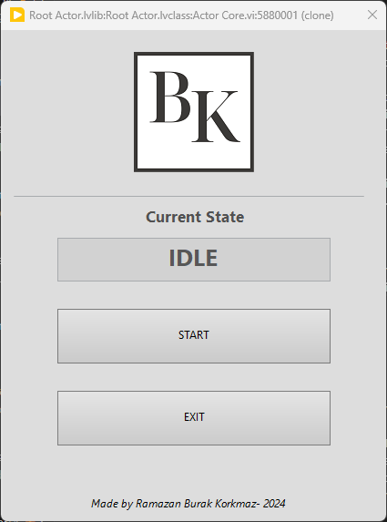
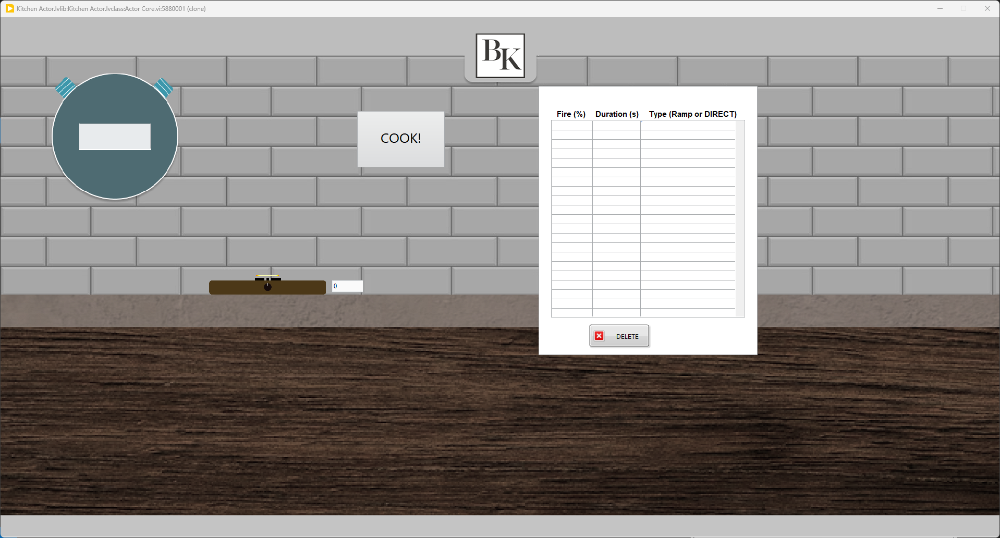

# chef
Auto Cooker with Actor Framework implementation in LabVIEW

**DESCRIPTION**
This project's main goal is to replicate and simulate an cooking enviroment. In this project there are 3 main states to control situation in the simulation. These are
- **INIT**: State that we initilize required parameters and stuff before executing simulation. Currently there is no initilizingof any parameters.
- **IDLE**: State that the program spends most of the time in it. We simply wait to start Kitchen simulation in this state. There could be other implementation to this state in the future.
- **COOKING**: State that main simulation goes on. In this state, kitchen actor works to simulate a kitchen enviroment.

**HOW TO USE**
First of all you need to start Launcher.vi to run all Actors in the project. After that it will disappear and you will be greeted with screen below.

This screen is login page of the program. Current state shows the program's current state and operating status. By clicking Start button you can run Kitchen Simulation part of the program which is the main component for now. The kitchen simulatiın will look like below.

In this screen, there is a current timer clock, a recipe control and a button to start cooking all recipe steps. In the recipe table, each row represents a step. Each step has three different property for now. These are
- **Fire (%)**: Represents how much you open the oven gas controller. It takes valeus between 0-100 %.
- **Duration (s)**: Represents the duration to apply heat.
- **Type (RAMP or DIRECT)**: Represents oven types. There are two different oven types. First one is direct one. It changes percentage of oven gas control directly to desired value. Second one is ramp oven. It changes percentage of oven gas control to desired value with a ramp from the last value.
If you want to exit kitchen simulation you can simply click close button at the top right of your screen. This will execute Kitchen simulation. If you want to run it again after closing it, you can simply click Start button at the login page.

## <ins>GOALS</ins>
- checCreate basic recipe (Fire and Fire Duration) (DONE✅)
- Make sure Timer Actor sends a signal when duration is elapsed. (DONE✅)
- Create a recipe steping system with Timer Actor (DONE✅)
- Simultaneously update duration in step (DONE✅)
- Add new ways to keep track of duration. Use Time Delayed Send Message in
Timer Actor with counter logic (counter indivual small piece of elapsed time) (Worse than while loop approach
so I skip this step) (DONE✅)
- Refactor Chef Actor main event with self messages (DONE✅)
- Refactor all local variables to property nodes or private data (DONE✅)
- Implement State Machine to Chef actor event. Make sure you encapsulate state classes.
- Add more options to recipe
- Add recipe step execution animation such as fire in oven, roasting,etc.
- Add SubVI selection from Actor main UI in Launcher VI
- Send Telegram messages with each step done and whole meal completion status.
